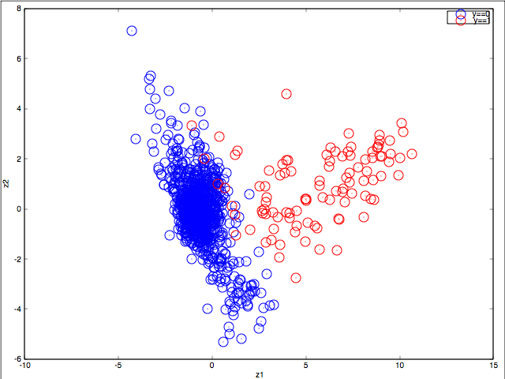

# Pulsar-Identification

#### Given the features, a K-Means Classifier can be trained for predicting a star to become a Pulsar in its course of life. This repo presents the solution of this binary classification that could be easily handled by a supervised learning algorithm, but K-Means appears to be effectively dealing with this sort of problem. Attached image is the visualization of 1K randomly chosen examples from the data collected from Kaggle. There are 8 features in total that have been reduced down to 2-dimensions to visualise the data.

#### Using K-Means on reduced dimensional data, an accuracy of at most 99.62% can be achieved.

## Instructions to run this code:

#### 1. Install required packages in virtual env
#### 2. Octave is a must required
#### 3. cd into "Pulsar-Identification/pulsar/" and run octave ex.m

